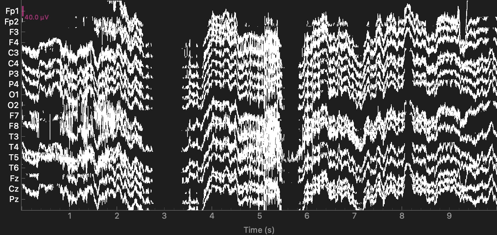
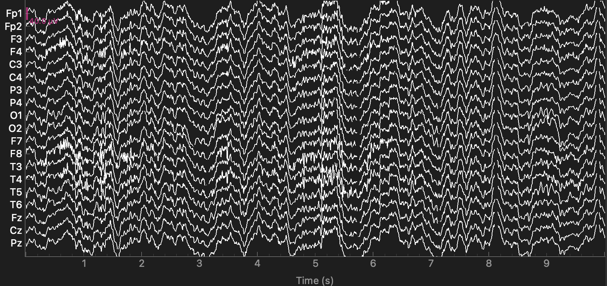
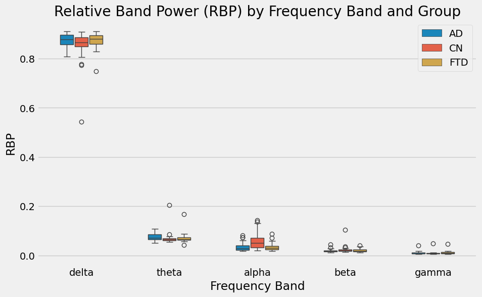

# EEG-Based Classification of Alzheimer's Disease and Frontotemporal Dementia

A comprehensive machine learning pipeline that implements signal processing techniques and machine learning algorithms to distinguish between Alzheimer's Disease (AD), Frontotemporal Dementia (FTD), and healthy controls using electroencephalography (EEG) data.

## Pipeline Overview

### 1. Signal Preprocessing
- **Bandpass Filtering**: 0.5–45 Hz Butterworth filter for noise removal
- **Artifact Subspace Reconstruction (ASR)**: Automatic removal of high-amplitude artifacts
- **Independent Component Analysis (ICA)**: Elimination of eye blink and muscle artifacts

### 2. Feature Extraction
- **Epoching**: 4-second windows with 50% overlap for temporal analysis
- **Power Spectral Density**: Welch's method for robust frequency domain analysis
- **Relative Band Power (RBP)**: Normalized power across physiological frequency bands:
  - Delta (0.5–4 Hz), Theta (4–8 Hz), Alpha (8–13 Hz), Beta (13–25 Hz), Gamma (25–45 Hz)

### 3. Model Training and Evaluation
- **Feature Selection**: Exhaustive search across all feature combinations
- **Model Selection**: Comprehensive evaluation of 5 algorithms (LightGBM, SVM, KNN, MLP, Random Forest)
- **Cross-Validation**: 5-fold for efficient and reliable performance estimation

## Visualizations

### Signal Preprocessing Quality
The preprocessing pipeline transforms noisy raw EEG signals into clean, analyzable data:

**Raw EEG Data**


**Preprocessed EEG Data**


### Feature Analysis
RBP distributions reveal distinct neurophysiological patterns across diagnostic groups:



## Results

| Classification Task | Accuracy | Optimal Model | Key Features |
|---------------------|----------|---------------|--------------|
| **AD vs. CN** | **76.92%** | LightGBM | Delta, Theta, Alpha, Beta RBPs |
| **FTD vs. CN** | **69.23%** | LightGBM | Alpha, Beta RBPs |

### Key Insights
- **Multi-band approach** improves AD classification performance
- **Alpha and Beta bands** demonstrate highest discriminative power for FTD detection
- **LightGBM** consistently outperforms other algorithms across both tasks

## Quick Start

1. **Setup Environment**:
   ```bash
   conda env create -f environment.yml
   conda activate eeg-classification-ad-ftd
   ```

2. **Prepare Data**: Place all `sub-0XX` folders (each containing EEG `.set` files) and the `participants.tsv` file from the OpenNeuro ds004504 dataset into the `data/raw/` directory.

3. **Run Pipeline**:
   ```bash
   python src/pipeline.py
   ```

## Future Enhancements

- Outlier Detection and Removal
- Enhanced Signal Preprocessing Techniques
- Hyperparameter Optimization

## References

- Dataset: [OpenNeuro ds004504](https://openneuro.org/datasets/ds004504)
- Data Descriptor: [10.3390/data8060095](https://doi.org/10.3390/data8060095)
- Original Study: [10.1109/ACCESS.2023.3294618](https://doi.org/10.1109/ACCESS.2023.3294618)
- ASRpy: [GitHub Repository](https://github.com/DiGyt/asrpy) (BSD-3-Clause License)
